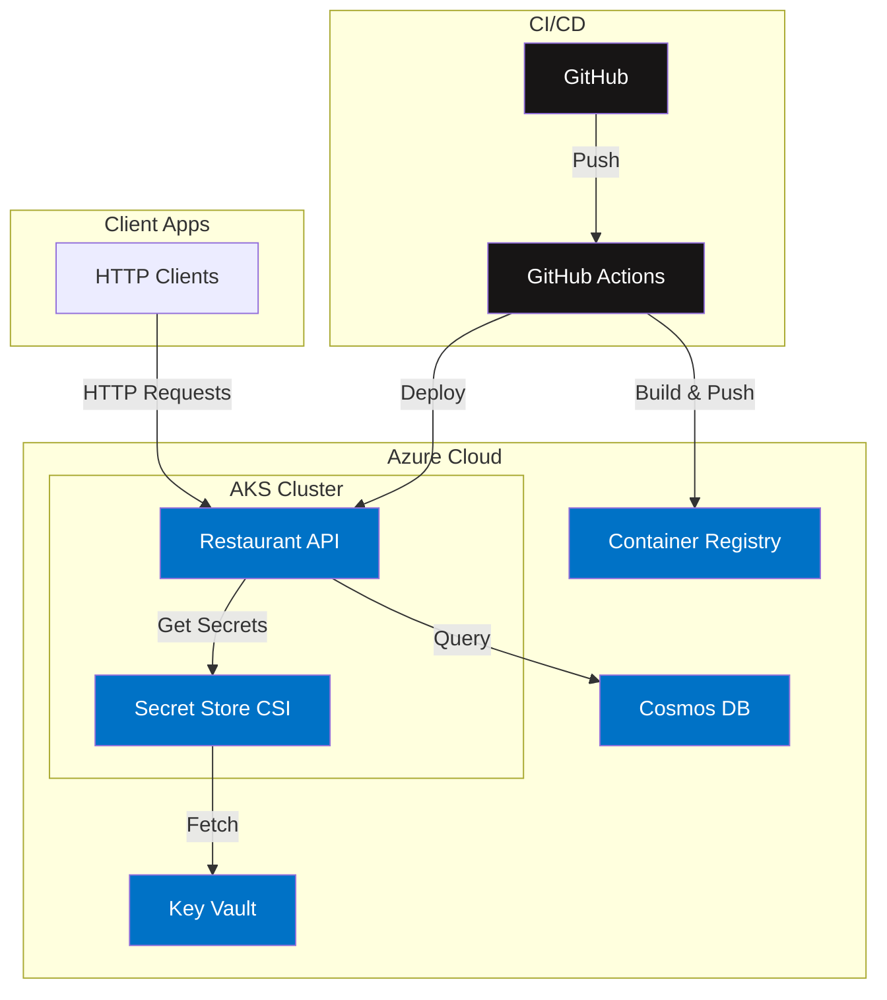
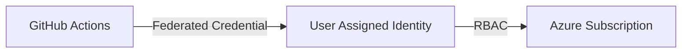
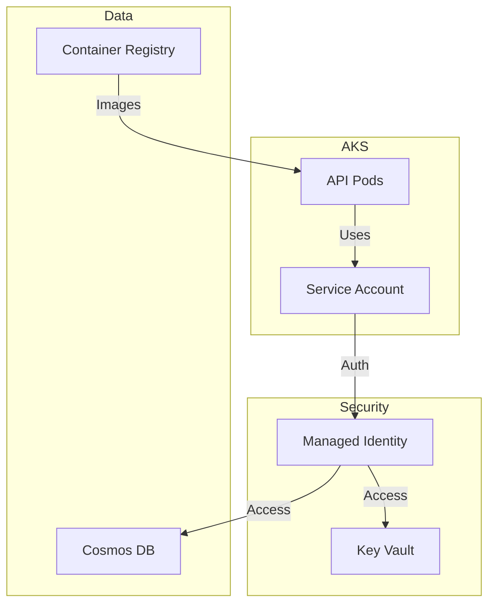

# Restaurant Recommendations API 🍽️

A production-ready restaurant recommendations service built with Python/Flask, deployed on Azure Kubernetes Service (AKS), and managed with Infrastructure as Code (Terraform). The service provides restaurant suggestions based on cuisine style, vegetarian options, and delivery availability.

## 🏗️ Architecture Overview



## 🌟 Features

- RESTful API for restaurant recommendations
- Filtering by cuisine style, vegetarian options, and delivery availability
- Real-time availability based on opening hours
- Request logging to Cosmos DB
- Containerized application with Docker
- Secure secret management with Azure Key Vault
- Infrastructure as Code with Terraform
- Automated CI/CD with GitHub Actions

## 🚀 Tech Stack

- **Backend**: Python 3.9, Flask 2.2.2
- **Database**: Azure Cosmos DB
- **Infrastructure**: 
  - Azure Kubernetes Service (AKS)
  - Azure Container Registry (ACR)
  - Azure Key Vault
  - Azure Cosmos DB
  - Virtual Network and subnet
- **DevOps**:
  - Terraform for Infrastructure as Code
  - GitHub Actions for CI/CD
  - Docker for containerization
  - Helm for Kubernetes deployments

## 📁 Project Structure

```
.
├── app/                            # Application source code
│   ├── data/                      # Restaurant data
│   ├── tests/                     # Unit tests
│   ├── app.py                     # Main application
│   ├── requirements.txt           # Python dependencies
│   └── Dockerfile                 # Container configuration
├── deployment/                     # Kubernetes/Helm configuration
│   ├── templates/                 # Helm templates
│   ├── chart.yaml                 # Helm chart definition
│   └── values.yaml                # Helm values
├── infra/                         # Infrastructure as Code
│   ├── 1-github-azure-integration/# GitHub-Azure setup
│   ├── 2-restaurants-app/         # Main infrastructure
│   └── bootstrap.sh               # Infrastructure setup script
└── .github/
    └── workflows/                 # GitHub Actions workflows
```

## 🔄 CI/CD Workflows

### 1. Python Lint and Test
- **File**: `python-lint-and-test.yaml`
- **Trigger**: Pull requests to main
- **Actions**:
  - Runs flake8 for linting
  - Executes pytest suite
  - Provides workflow summary

### 2. PR Title Validator
- **File**: `pr-title-validator.yaml`
- **Purpose**: Validates PR titles follow conventional commit format
- **Benefit**: Ensures consistent commit history

### 3. Build and Deploy
- **File**: `build-and-deploy-aks.yml`
- **Trigger**: Pushes to main
- **Actions**:
  - Builds and pushes Docker image to ACR
  - Deploys to AKS using Helm
  - Uses Workload Identity for secure authentication

## 🏗️ Infrastructure Components

### 1. GitHub-Azure Integration


### 2. Main Infrastructure


## 🔧 Infrastructure Setup

### Prerequisites
- Azure CLI
- Terraform >= 1.0
- kubectl
- Helm

### Initial Setup

1. Bootstrap infrastructure:
```bash
cd infra
./bootstrap.sh
```

2. Deploy GitHub-Azure integration:
```bash
cd 1-github-azure-integration
terraform init
terraform apply -var-file=../environments/dev/github-azure-integration/env.auto.tfvars
```

3. Deploy main infrastructure:
```bash
cd ../2-restaurants-app
terraform init
terraform apply -var-file=../environments/dev/restaurants-app/env.auto.tfvars
```

## 🔌 API Documentation

### GET /recommendations

Get restaurant recommendations based on filters.

**Query Parameters:**
- `style`: Cuisine style (e.g., "Italian", "French")
- `vegetarian`: "yes" or "no"
- `delivery`: "yes" or "no"

**Example Request:**
```bash
curl "http://localhost:5000/recommendations?style=Italian&vegetarian=yes"
```

**Example Response:**
```json
{
  "restaurantRecommendation": [
    {
      "name": "Pizza Hut",
      "style": "Italian",
      "address": "Wherever Street 99, Somewhere",
      "openHour": "09:00",
      "closeHour": "23:15",
      "vegetarian": "yes"
    }
  ]
}
```

## 🚀 Local Development

1. Clone the repository:
```bash
git clone [repository-url]
```

2. Set up Python environment:
```bash
cd app
python3 -m venv venv
source venv/bin/activate  # or `venv\Scripts\activate` on Windows
pip install -r requirements.txt
```

3. Run tests:
```bash
pytest
```

4. Start the application:
```bash
python3 app.py
```

## 👤 Author
Created by Niv B

## 📄 License
This project is licensed under the MIT License
